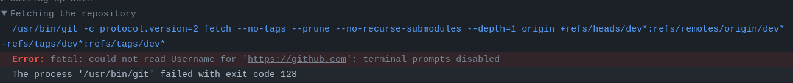
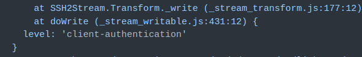

# ODOO + Github Action

Execute CICD workflow for private Odoo repo

## Setup

For a newly Odoo repository, that need CICD process, following below instructions:

1. Determine repo name *(1)*
e.g: vdx-vn/cuu-long

1. Create new branch  name *(1)* from production branch

1. Replace <private_repo_path> value in file [private-cicd.yml](.github/workflows/private-cicd.yml) by *(1)*

1. Go to [repo setting](https://github.com/xmars4/odoo-cicd-executor/settings/secrets/actions), create new environment named *(1)*
with following secrets and variables:

## Problems & Solutions

1. **Non-expired PAT (personal access token) when checking out other repo**

    

- **Solution:** Set an expiration date for the PAT

1. **Cannot authenticate by SSH**

   

- **Solution**:

    ```bash
     # Generate SSH key using a different algorithm
     ssh-keygen -t ecdsa -b 521
     ```

.
